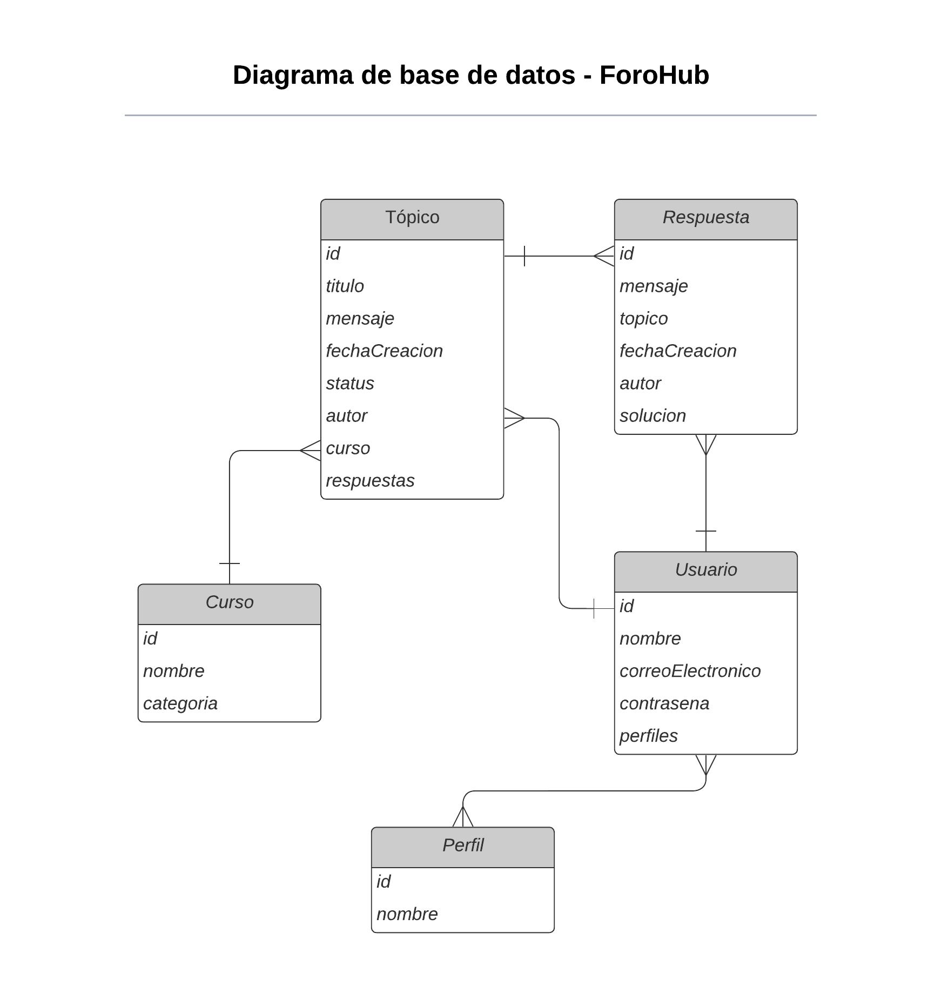
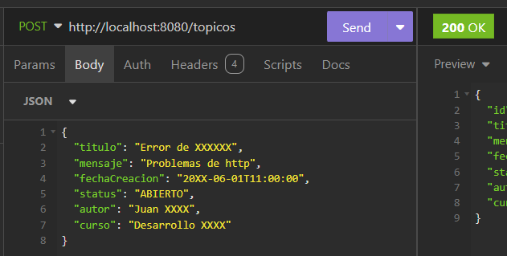

# FORO HUB CHALLENGE
Un foro es un espacio donde todos los participantes de una plataforma pueden plantear sus preguntas sobre determinados tópicos. Crearemos una **API REST** usando **Spring** para saber cómo se tratan los datos, cómo se relaciona un tópico con una respuesta, o cómo se relacionan los usuarios con las respuestas de un tópico. 

Nuestra API se centrará específicamente en los tópicos, y debe permitir a los usuarios:

a) Crear un **CRUD** (CREATE, READ, UPDATE, DELETE):
* Crear un nuevo tópico;
* Mostrar todos los tópicos creados;
* Mostrar un tópico específico;
* Actualizar un tópico;
* Eliminar un tópico.

b) Validaciones realizadas según las reglas de negocio;

c) Implementación de una base de datos relacional para la persistencia de la información;

d) Servicio de autenticación/autorización para restringir el acceso a la información.

# Programas, archivos y versiones utilizados:

 * Java JDK: versión 17 en adelante - Descarga la última versión LTS de Java gratuita 
 * Maven: versión 4 en adelante
 * Spring Boot: versión 3 en adelante
 * MySQL: versión 8 en adelante
 * IDE (Entorno de desarrollo integrado) IntelliJ IDEA - opcional -

### Configuración al crear Spring Initializr:

 - Java (versión 17 en adelante)
 - Maven (Initializr utiliza la versión 4)
 - Spring Boot
 - Proyecto en formato JAR

### Dependencias para agregar al crear el proyecto con Spring Initializr:

 - Lombok
 - Spring Web
 - Spring Boot DevTools
 - Spring Data JPA
 - Flyway Migration
 - MySQL Driver
 - Validation
 - Spring Security

### Construcción de la base de datos:
Algunos enlaces importantes tanto para la instalación de MySQL como para la configuración de la base de datos a través del proyecto Spring.
- [MySQL Installer](https://dev.mysql.com/downloads/installer/)
- Agregar algunas dependencias en nuestro `pom.xml` (Validation, MySQL Driver, Spring Data JPA, Flyway Migration)
- Crear un tópico con la siguiente información: id, título, mensaje, fecha de creación, status (estado del tópico), autor, curso.
- Diagrama de Base de datos. Nota: se representa una base de datos más completa pero no se implementan todas las tablas presentes en él - es suficiente centrarse en la tabla de tópicos. 

### **CRUD** (CREATE, READ, UPDATE, DELETE):
La API cuenta con:
* Un endpoint (punto final) para el *registro* de tópicos, y debe aceptar solicitudes del tipo POST para la URI /tópicos.  Los datos (título, mensaje, autor y curso) deben ser enviados en el cuerpo de la solicitud, en formato JSON.
* Un endpoint (punto final) para el *listado* del tópico, y debe aceptar solicitudes del tipo GET para la URI /tópicos/{id}. Los datos (título, mensaje, fecha de creación, estado, autor y curso) deben ser devueltos en el cuerpo de la respuesta, en formato JSON. 
* Un endpoint idem anterior para todos los tópicos (URI /tópicos). Se muestran los primeros 10 resultados ordenados por fecha de creación del tópico en orden ASC.  
* Un endpoint (punto final) para la *actualización* de los datos de un determinado tópico, y debe aceptar solicitudes del tipo PUT para la URI /tópicos/{id}. Mismas reglas de negocio que antes.
* Un endpoint para la eliminación de un tópico específico, el cual debe aceptar solicitudes del tipo DELETE para la URI /tópicos/{id}.

### Pruebas de la API
Las pruebas de las funcionalidades de la API pueden realizarse utilizando alguna herramienta de pruebas de API, como Postman o Insomnia.
* [Postman:](https://www.postman.com)
* [Insomnia:](https://insomnia.rest)

### Autenticación y configuración de Seguridad

Solo los usuarios autenticados pueden interactuar con la API. Para configurar la autenticación se utilizó `Spring Security`.
Y implementar el mecanismo de autenticación en la API, se modificó la estructura de base de datos, incluyendo una nueva tabla para almacenar los datos de autenticación de los usuarios.
Para este caso, se crea una migración. Para lo cual usamos `Flyway Migration`.

### Generar un token con JWT

Para agregar mayor seguridad, una opción muy ventajosa es requerir tokens para autenticación. El JWT (JSON Web Token) es un estándar utilizado para compartir información entre cliente y servidor que será muy útil en esta tarea.

Esta biblioteca es importante precisamente para poder generar el token en el **estándar JWT** y así agregarlo en la configuración de seguridad de nuestro proyecto, creando una clase DTO `UsernamePasswordAuthenticationToken` para recibir el nombre de usuario y contraseña.

Web: [JWT.IO](https://jwt.io/)

## Conclusión

A lo largo de este proyecto, hemos logrado implementar un sistema completo de CRUD (Crear, Leer, Actualizar, Eliminar) para los tópicos, integrando funcionalidades de validación, persistencia en una base de datos relacional MySQL, y un sólido mecanismo de autenticación y autorización con Spring Security y JWT.

### Logros Destacados:

* Implementación del CRUD: Hemos desarrollado endpoints para crear, leer, actualizar y eliminar tópicos, permitiendo a los usuarios gestionar la información de manera efectiva.

* Validaciones y Reglas de Negocio: Se han aplicado validaciones según las reglas de negocio definidas, asegurando la integridad de los datos y una experiencia de usuario consistente.

* Persistencia en Base de Datos: Utilizamos Spring Data JPA y Flyway Migration para gestionar la estructura de la base de datos y las migraciones, facilitando el mantenimiento y la evolución del sistema.

* Seguridad y Autenticación: Implementamos un sistema robusto de autenticación basado en tokens JWT con Spring Security, restringiendo el acceso a recursos sensibles solo a usuarios autenticados y autorizados.

* Implementación de Paginación: Se consideró la adición de paginación en las consultas para manejar grandes volúmenes de datos de manera eficiente.

En resumen, el proyecto Foro Hub Challenge no solo ha demostrado nuestras habilidades en el desarrollo de aplicaciones basadas en Spring, sino que también nos ha preparado para enfrentar desafíos más complejos en el futuro. Estamos comprometidos con la mejora continua y el aprendizaje, buscando siempre ofrecer soluciones innovadoras y eficientes.

